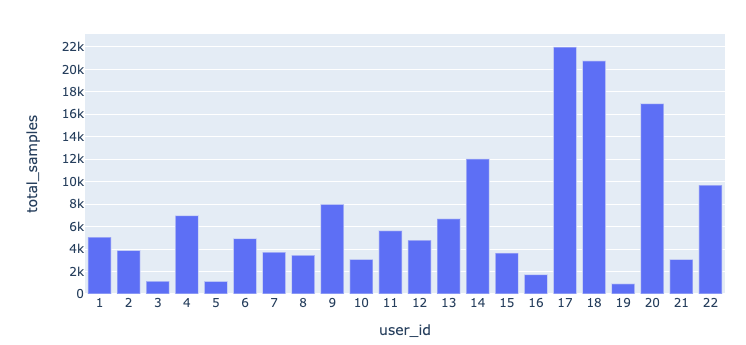
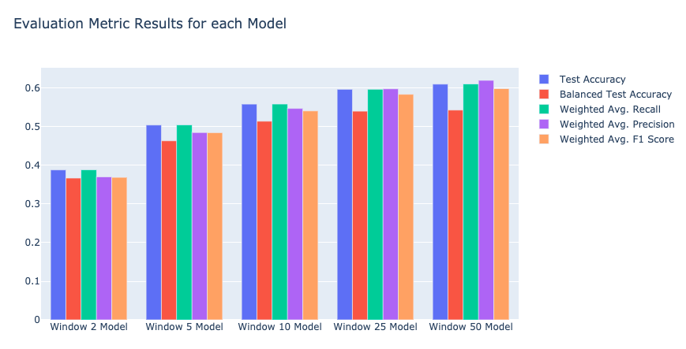

# time-series-user-classification

Example ML Project for Time Series Classification, trying to do User Identification based on x,y,z walking sensors.

**Dataset:** https://archive.ics.uci.edu/ml/datasets/User+Identification+From+Walking+Activity#

22 different users (classes), can see some class imbalance. Around ~150 total raw sensor samples.

## Notebooks

`full_classify_workflow_rforest.ipynb`
- proper train / test split for time series data
- Feature Engineering with time series windowing
- Exploratory Data Analysis
- Multiclass Classification with Scikit-Learn
- Evaluation Metrics and Plots
- GridSearchCV Example

`full_classify_workflow_rforest_1vsrest.ipynb`
- copy of full_classify_workflow_rforest.ipynb but trying 1 vs all ML classifier

`sktime_rocket_classify.ipynb`
- Time Series classification using sktime library, ROCKET (random convolutional kernels) time series classifer model which has shown state of the art performance in a range of time series classification benchmarks

## Results
Showing random forest classification results for different size windowing / lag features on dataset.

Increasing the window size shows decreasing performance gain, not getting higher than ~60% test accuracy

## Resources on sktime, ROCKET
- https://github.com/alan-turing-institute/sktime/blob/main/examples/02_classification_univariate.ipynb
- https://github.com/alan-turing-institute/sktime/blob/main/examples/03_classification_multivariate.ipynb
- https://github.com/alan-turing-institute/sktime/blob/main/examples/rocket.ipynb
- http://www.timeseriesclassification.com/index.php
- *ROCKET: Exceptionally fast and accurate time series classification using random convolutional kernels.* - https://github.com/angus924/rocket
